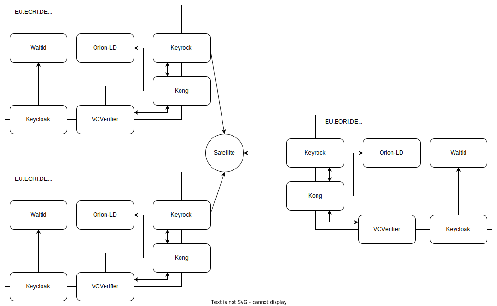

# Demo Environment for Batterypass

In order to demonstrate a DataSpace, using [FIWARE](https://www.fiware.org/) technologies and the [i4Trust Security Framework](https://github.com/i4Trust/building-blocks). 

## Description

The demonstrator consists of 3 participants, namend(for the sake of simplicity) One, Two and Three. Each of them has runs the following components:

* [Orion-LD Context Broker](https://github.com/FIWARE/context.Orion-LD) to provide the standardized [NGSI-LD API](https://www.etsi.org/deliver/etsi_gs/CIM/001_099/009/01.06.01_60/gs_cim009v010601p.pdf)
* [Kong](https://konghq.com/) as an API-Gateway, extended with [FIWARE Plugins](https://github.com/FIWARE/kong-plugins-fiware) to act as Policy enforcment point(PEP) in the [i4Trust framework](https://github.com/i4Trust/building-blocks#access--usage-control--policies)
* [Keyrock](https://fiware-idm.readthedocs.io/en/latest/) as a general IDM and as [AuthorizationRegistry & Token-Endpoint in i4Trust](https://github.com/i4Trust/building-blocks)

Additionally, a central TrustProvider is installed - the [iShare-Satellite](https://dev.ishare.eu/scheme-owner/parties-id.html#request). Every participant is registered and identified at the satellite with an EORI and an certificate. 
> :warning: All certificates and keys in this repo are generated just for the demonstrational pruposes. They have no value outside of this, therefor they are plain-text to ease the learning-curve.

The following diagramm shows the components:




## Endpoints

In order to participate in the DataSpace, the participants have to provide certain endpoints:

* an NGSI-LD Api serving the data -> provided via Kong at <NAME>.batterypass.fiware.dev/i4trust
* a [token-endpoint](https://dev.ishare.eu/common/token.html) to exchange the [iShare-compliant JWT](https://dev.ishare.eu/introduction/jwt.html) into an access-token -> provided by Keyrock at idm-<NAME>.batterypass.fiware.dev/oauth2/token
* a [delegation-endpoint](https://dev.ishare.eu/delegation/endpoint.html) to be used by Kong for policy evaluation -> provided by Keyrcok at idm-<NAME>.batterypass.fiware.dev/ar/delegation
* a [trusted-list endpoint](https://dev.ishare.eu/scheme-owner/trusted-list.html) as the central trust anchor -> provided by the [satellite](./applications/satellite/) at satellite.batterypass.fiware.dev/trusted_list
* a [parties endpoint](https://dev.ishare.eu/scheme-owner/parties.html) for information about the trusted parties -> provided by the [satellite](./applications/satellite/) at satellite.batterypass.fiware.dev/parties

In addition, the Keyrock-instances do provide a /ar/policy endpoint for creating policies to manage the access-control. Policies can be created, using the [DelegationEvidence-Format](https://dev.ishare.eu/delegation/delegation-evidence.html). See the [Postman-Collection](Batterypass.postman_collection.json) for examples. 

## Util

### LD-Contexts

In order to ease the usage of the setup, a [context-server](https://github.com/wistefan/context-server) is available at https://context.batterypass.fiware.dev/, API see the [OpenAPI](https://forge.etsi.org/swagger/ui/?url=https://raw.githubusercontent.com/wistefan/context-server/master/api/api.yaml) for the available endpoints.

### iShare-JWT

Since all M2M-connections in an i4Trust environment require the usage of [iShare-compliant JWT's](https://dev.ishare.eu/introduction/jwt.html), the [ishare-jwt-helper](https://github.com/wistefan/ishare-jwt-helper) is deployed, to serve tokens for all configured participants. The endpoint is available at [https://one.batterypass.fiware.dev/token], requiring an API-Key provided via the `X-Api-Key` header(see [postman-collection](Batterypass.postman_collection.json) for an example). The key is generated by Kong on startup, users logged-in to the OpenShift cluster can retrieve it via:

```shell
    kubectl port-forward kong-one-kong-<POD-ID> 8001:8001 -n batterypass
    curl --location --request GET 'localhost:8001/key-auths'
```

## Deployment

The repository follows the [app-of-apps approach](https://argo-cd.readthedocs.io/en/stable/operator-manual/cluster-bootstrapping/). The [batterypass-folder](./batterypass/) contains the chart for generating and configuring the [ArgoCD Applications](https://argo-cd.readthedocs.io/en/stable/), while [applications](./applications/) contains the individual components. In the [ci-workflow](./.github/workflows/deploy.yaml) the deploy command can be found, e.g. ```helm template ${{ secrets.OVERWRITE_VALUES }} -f values-demo.yaml . | oc -n argocd apply -f -```. [values-demo.yaml](./batterypass/values-demo.yaml) contains the currently deployed demo-environment configuration.
