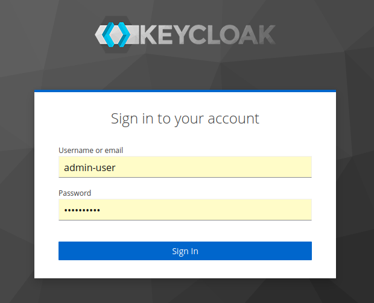
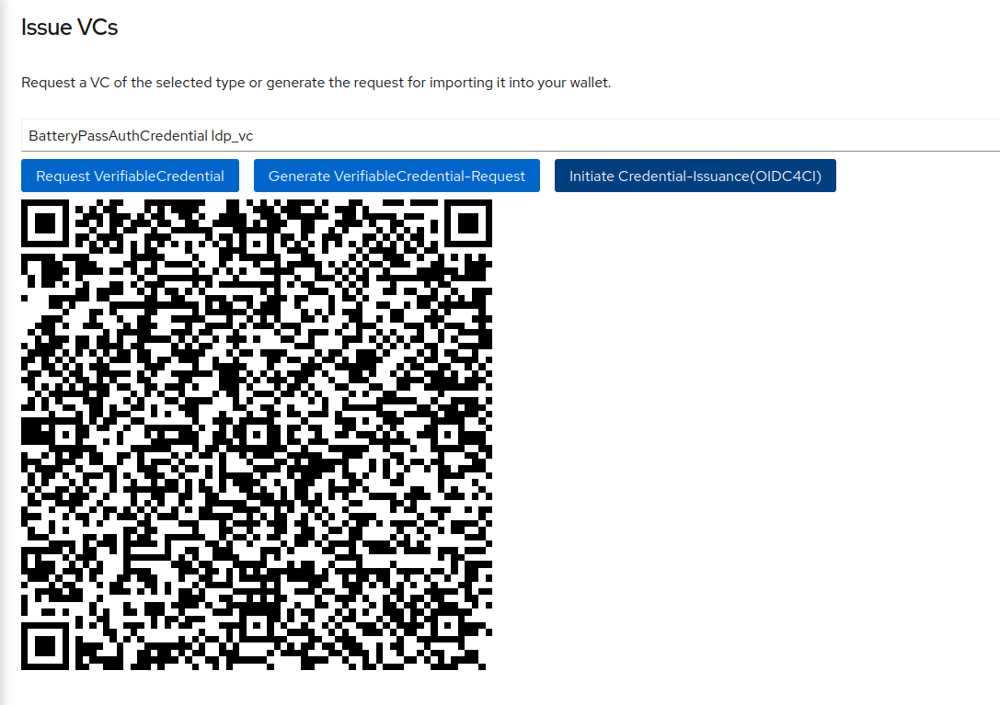

# Access services using VerifiableCredentials

The demonstrator supports data-access via [SIOP-2](https://openid.net/specs/openid-connect-self-issued-v2-1_0.html) using [VerfiableCredentials](https://www.w3.org/TR/vc-data-model/) as defined in the latest release of the [i4Trust-Buildingblocks](https://github.com/i4Trust/building-blocks).

## The DID

In order to participate in the dataspace, using [VerfiableCredentials](https://www.w3.org/TR/vc-data-model/), every participant has to have a [Decentralized Identifier(DID)](https://www.w3.org/TR/did-core/). In order to be compliant with the [Gaia-X Trust Framework](https://gaia-x.gitlab.io/policy-rules-committee/trust-framework/) the [did:web method](https://w3c-ccg.github.io/did-method-web/) is used. For the demonstrator, the [Let's encrypt](https://letsencrypt.org/) certificates, used for https on the ingress-routes, are also reused for the did. 
For each participant, the corresponding instance of [WaltId](https://github.com/walt-id/waltid-ssikit) is configured to use the certificates private key as signing key(see f.e. [keycloak-one init](../applications/one/keycloak-one/templates/didConfigMap.yaml)) and to provide the certificate-chain through the(see the x5u parameter of the did.json) published endpoint(see [WaltId One Cert-Deployment](../applications/one/waltid-one/templates/deployment.yaml)). 
Therefore the participant did's are:

| Participant | DID | did.json | x5u |
|-------------|-----|----------|-----|
| One | did:web:one.batterypass.fiware.dev:did | [one.batterypass.fiware.dev/did/did.json](https://one.batterypass.fiware.dev/did/did.json) |[https://one.batterypass.fiware.dev/certs/tls.crt](https://one.batterypass.fiware.dev/certs/tls.crt) |
| Two | did:web:two.batterypass.fiware.dev:did | [two.batterypass.fiware.dev/did/did.json](https://two.batterypass.fiware.dev/did/did.json) |[https://two.batterypass.fiware.dev/certs/tls.crt](https://one.batterypass.fiware.dev/certs/tls.crt) |
| Three | did:web:three.batterypass.fiware.dev:did | [three.batterypass.fiware.dev/did/did.json](https://three.batterypass.fiware.dev/did/did.json) |[https://three.batterypass.fiware.dev/certs/tls.crt](https://three.batterypass.fiware.dev/certs/tls.crt) |

Paths to did.json and x5u are only provided for convinience, the can be build from the did following the definition of method ```web```.

> :bulb: did:web:one.batterypass.fiware.dev:did can be resolved as following:
> - check that it starts with did
> - check method -> method web describes the approach for the next step
> - take everything before the first ```:``` as the host, only request using https -> ```https://one.batterypass.fiware.dev```
> - everything seperated with ```:``` will be a sub-path, e.g.  ```https://one.batterypass.fiware.dev/did/```
> - once everything is resolved, append ```did.json```-> ```https://one.batterypass.fiware.dev/did/did.json``` 


## Setup

To use this in the batterypass data-space, the following roles have to be provided:

- Credentials Issuer - issue the actual VerifiableCredentials to users
- Credentials Verifier/RelyingParty - verify a credential and exchange it with JWT-token
- Policy Decision Point/Policy Enforcement Point - checks the contents of the credential provided via JWT and authorizes or rejects the request
- Policy Registry - holds the information about trusted issuers and policies assigned to roles
- Policy Enforcement Point - receives all external requests and enforces the policy decisions on them
- Trusted Issuers List - provide information about the Credentials and Claims an Issuer is allowed to issue
- Trusted Participants List - provide information about the Participants in the dataspace


The components fullfilling those roles:

### Credentials Issuer

As Issuer, every participant has an instance of [Keycloak](https://www.keycloak.org/) with the [Keycloak-VC-Issuer Plugin](https://github.com/wistefan/keycloak-vc-issuer) installed. They are available at ```kc-<ONE|TWO|THREE>.batterypass.fiware.dev```. Each of them has various users preconfigured, that can retrieve credentials for accessing participant ONE at ```https://one.batterypass.fiware.dev/vc/ngsi-ld/v1```.

> :bulb: for simplicity, all users have their username as their password.

Get a VerifiableCredential for users in TWO:

- go to https://kc-two.batterypass.fiware.dev/realms/fiware-server/account/ and login with user battery-user



- go to the verifiable credentials tab
- choose "BatteryPassAuthCredential ldp_vc" and "Initiate Credential-Issuance(OIDC4CI)"
> :bulb: The "Request VerfiableCredential" and "Generate VerifiableCredential-Request" buttons provide proprietary and unsecure access to credentials,
> that was used before [OIDC4CI](https://openid.net/specs/openid-4-verifiable-credential-issuance-1_0.html) was specified. They will be removed in one of 
> the next versions.



- use a wallet like ```demo-wallet.fiware.dev``` and scan the credential

The issued credential will look similar to the following one:

```json
{
  // type BatteryPassAuthCredential
  "type": ["BatteryPassAuthCredential"],
	"@context": ["https://www.w3.org/2018/credentials/v1", "https://w3id.org/security/suites/jws-2020/v1"],
	"id": "urn:uuid:f332aff1-850b-4d98-b4f4-8292c72a399a",
  // configured DID of the issuer Keycloak TWO
	"issuer": "did:web:two.batterypass.fiware.dev:did",
	"issuanceDate": "2023-02-06T08:41:06Z",
	"issued": "2023-02-06T08:41:06Z",
  // not valid before
	"validFrom": "2023-02-06T08:41:06Z",
	// not valid after
  "expirationDate": "2023-02-08T20:41:06Z",
  // json.schema for the credential
	"credentialSchema": {
		"id": "https://raw.githubusercontent.com/FIWARE-Ops/batterypass-demonstrator/main/docs/schema.json",
		"type": "FullJsonSchemaValidator2021"
	},
  // the subject, format depends on the type ob credential
	"credentialSubject": {
		"id": "did:ebsi:2AEMAqXWKYMu1JHPAgGcga4dxu7ThgfgN95VyJBJGZbSJUtp",
    // family name of the user
		"familyName": "Battery",
    // first name of the user
		"firstName": "Happy",
		"roles": [{
      // role assigned to the user
			"names": ["BATTERY_VIEWER"],
      // did of the siop-2 client, targetded by the role - e.g. did of Verifier ONE
			"target": "did:web:one.batterypass.fiware.dev:did"
		}],
    // email of the user
		"email": "battery-user@fiware.org"
	},
  // proof of the credential, use for verification
	"proof" : {
    "type" : "JsonWebSignature2020",
    "creator" : "did:web:two.batterypass.fiware.dev:did",
    "created" : "2023-06-20T13:25:28Z",
    "verificationMethod" : "did:web:two.batterypass.fiware.dev:did#a5947689f4fe4689b72eddf0e3a4eb5b",
    "jws" : "eyJiNjQiOmZhbHNlLCJjcml0IjpbImI2NCJdLCJhbGciOiJQUzI1NiJ9..Bq3eu00ivc2AzpvSIaB1ZDI5BWziSB58ezYt7mf_qun5Z3ItZx9f44M0lPiiwO28RMj0MW9y3ykrWseYeAFzZ871fi8WAsg5K1fLr3ZmViBMC11SUtmdqyMHPfYAcnwO-govuGlGpQQfgb5ZUKCu7tFgJSpWmRFW1SvxLcnQmwCIkiaRmNKrpVVWl6wE0MripiPhr26lLKIWb5krknD67du0q-WfUaQIIvo8R1sSq-saUjpMvwbzL4b5uO8QcYxfm1WLT7xeLq7zZH6Ds3tAWkbtndlHzvEUX4z59-GTm9gBlgOQZdUSkdDr7-K-adPN4UwbEuE0dD88kXLUhbiONg"
  }
}
```

### Credentials Verifier / Relying Party

The verifier is responsible for verifying the actual credential. This includes checking the signature and validity of the credential, checking the schema and the inclusion of the issuer in the dataspaces' trusted-list and the capabilities of the issuer with the Trusted Issuers List.
Once verification is done, the Verifier provides a JWT to the client, wich can be used to access downstream services. The JWT includes the credential in its payload, so that the information can further be used(f.e. in order to make authorization decisions). Downstream services only have to check the validity of the JWT, instead of the full credential.
In order to provide a frontend to be used for demonstration, a [demo-portal](https://github.com/i4Trust/pdc-portal) is deployed. It is integrated with the login-page provided by the [Verifier](https://github.com/FIWARE/VCVerifier). When choosing "Login with VC", popup presenting the QR to initiate the [SIOP-2 Flow](https://openid.net/specs/openid-connect-self-issued-v2-1_0.html) shows up and will fullfill the authentication-flow.
To access the secured APIs, go to the [Portal's Index-Page](https://portal-one.batterypass.fiware.dev/) and choose "Login with VC":
1. Go to Index-Page


2. Scan the QR from the popup with your wallet:
 

3. Accept the Request and send the credential from the wallet:


4. The popup will close and you get forwarded to the portal:


5. You can now tryout the received JWT to request the service. Depending on the issuer and role, various requests are possible. (ONE and TWO - request entities of type BATTERY, THREE request the SoC-attribute of batteries)


An example JWT will look like:

```json
{
  "alg": "ES256",
  "kid": "f959ce6b-9cb0-4486-afad-dd0d3ae4afbd",
  "typ": "JWT"
}.
{
  // no additional claims included, yet. format will be further defined in the future.
  // the credential content
	"verifiableCredential": {
		"@context": [
			"https://www.w3.org/2018/credentials/v1",
			"https://w3id.org/security/suites/jws-2020/v1"
		],
		"credentialSchema": {
			"id": "https://raw.githubusercontent.com/FIWARE-Ops/batterypass-demonstrator/main/docs/schema.json",
			"type": "FullJsonSchemaValidator2021"
		},
		"credentialSubject": {
			"email": "battery-user@fiware.org",
			"familyName": "Battery",
			"firstName": "Happy",
			"id": "did:ebsi:2AEMAqXWKYMu1JHPAgGcga4dxu7ThgfgN95VyJBJGZbSJUtp",
			"roles": [{
				"names": [
					"BATTERY_VIEWER"
				],
				"target": "did:web:one.batterypass.fiware.dev/did/did.json"
			}]
		},
		"expirationDate": "2023-02-08T20:45:50Z",
		"id": "urn:uuid:bfd4574d-3a2c-4a10-8d4c-e8bcdf01ddcf",
		"issuanceDate": "2023-02-06T08:45:50Z",
		"issued": "2023-02-06T08:45:50Z",
		"issuer": "did:web:two.batterypass.fiware.dev:did",
		"proof" : {
      "type" : "JsonWebSignature2020",
      "creator" : "did:web:two.batterypass.fiware.dev:did",
      "created" : "2023-06-20T13:25:28Z",
      "verificationMethod" : "did:web:two.batterypass.fiware.dev:did#a5947689f4fe4689b72eddf0e3a4eb5b",
      "jws" : "eyJiNjQiOmZhbHNlLCJjcml0IjpbImI2NCJdLCJhbGciOiJQUzI1NiJ9..Bq3eu00ivc2AzpvSIaB1ZDI5BWziSB58ezYt7mf_qun5Z3ItZx9f44M0lPiiwO28RMj0MW9y3ykrWseYeAFzZ871fi8WAsg5K1fLr3ZmViBMC11SUtmdqyMHPfYAcnwO-govuGlGpQQfgb5ZUKCu7tFgJSpWmRFW1SvxLcnQmwCIkiaRmNKrpVVWl6wE0MripiPhr26lLKIWb5krknD67du0q-WfUaQIIvo8R1sSq-saUjpMvwbzL4b5uO8QcYxfm1WLT7xeLq7zZH6Ds3tAWkbtndlHzvEUX4z59-GTm9gBlgOQZdUSkdDr7-K-adPN4UwbEuE0dD88kXLUhbiONg"
    },
		"type": [
			"BatteryPassAuthCredential"
		],
		"validFrom": "2023-02-06T08:45:50Z"
	}
}.
signature
```

### Policy Decision Point/Policy Enforcement Point

To enforce authorization on requests, a Policy Decision Point(PDP) and a Policy Enforcement Point(PEP) is required. We provide this in a combination of the [Kong-API-Gatways](https://konghq.com/) with the [FIWARE Kong Plugin for External-Auth](https://github.com/FIWARE/kong-plugins-fiware) as a PEP and the [DSBA-PDP](https://github.com/FIWARE/dsba-pdp) as PDP. 
The PEP is configure to intercept all requests to the sub-path ```/vc``` and forward them to the PDP. The PDP will then evaluate the request and the corresponding JWT in three steps:

1. Verify the JWT - check the signature with the public key of the verifier
2. Check that one of the given roles is allowed to make the request

The PDP uses the Policy Registry to get the required policies. After evaluation, it responds with an accept or deny to the PEP, wich then enforces the decision.

### Policy Registry

In the [i4Trust](https://github.com/i4Trust/building-blocks) implementation of the SIOP-2 protocol, [Keyrock](https://github.com/ging/fiware-idm) with the [iShare compliant delegation endpoint](https://dev.ishare.eu/delegation/endpoint.html) is used as a Policy Registry. 

To authorize a request, a policy describing the role is required(the following example allows the Role BATTERY_VIEWER to access Batteries at participant ONE):

> :bulb: See [Access Token Doc](../README.md#policyregistry-access-token) for authorization

A policy defining the role and capabilities of the role:

```shell
# Policy creation endpoint on the keyrock of ONE
curl --location --request POST 'https://idm-one.batterypass.fiware.dev/ar/policy' \
# Token retrieved, following the steps in the hint
--header 'Authorization: Bearer <TOKEN>' \
--header 'Content-Type: application/json' \
--data-raw '{
  "delegationEvidence": {
    "notBefore": 1624634606,
    "notOnOrAfter": 1770041275,
    // iShare identifier of ONE
    "policyIssuer": "EU.EORI.DEONE",
    "target": {
      // name of the ROLE
      "accessSubject": "BATTERY_VIEWER"
    },
    "policySets": [{
      "maxDelegationDepth": 0,
      "target": {
        "environment": {
          "licenses": [
            "ISHARE.0001"
          ]
        }
      },
      "policies": [{
          "target": {
            // resource definition: all identifieres and attributes for entity-type BATTERY
            "resource": {  
              "type": "BATTERY",
              "identifiers": [
                "*"
              ],
              "attributes": [
                "*"
              ]
            },
            // only allow retrieval - e.g. HTTP-GET
            "actions": [
              "GET"
            ]
          },
          "rules": [{
            "effect": "Permit"
          }]
        }
      ]

    }]
  }
}'
```

### Trusted Issuers List

The [Trusted Issuers List](https://github.com/FIWARE/trusted-issuers-list) provides information about the issuers of credentials through an [EBSI-compliant Trusted Issuers Registry API](https://api-pilot.ebsi.eu/docs/apis/trusted-issuers-registry/latest#/). The issuers can be configured through the [Trusted Issuers List API](https://github.com/FIWARE/trusted-issuers-list/blob/main/api/trusted-issuers-list.yaml). See the [init-container config](../applications/trusted-issuers/templates/data-cm-one.yaml) for the used configuration. 

### Trusted Participants List

The Trusted Participants List is also an implementation of the [EBSI Trusted Issuers Registry API](https://api-pilot.ebsi.eu/docs/apis/trusted-issuers-registry/latest#/). Its used to just check for inclusion of the participant, without any further checks. In the demo-setup, all three participants are registered with there did.

## Demo Users & Roles

### The roles

The following roles are defined by participant ONE:

| Name                | Permissions                                              |
|---------------------|----------------------------------------------------------|
| BATTERY_ADMIN       | GET,POST,PUT,DELETE on all entites of type BATTERY       |
| BATTERY_VIEWER      | GET on all entites of type BATTERY                       |
| BATTERY_VIEWER_SOC  | GET on the attribute SoC for all entites of type BATTERY |

### The users
In all participants, some demo-users are provided:

> :bulb: If credentials for the user are allowed, depends on the trusted_list(see [first policy creation](#policy-registry)) of the participant. 
> In the demonstrator environment, ONE allows TWO to assign BATTERY_VIEWER and THREE BATTERY_VIEWER_SOC. Thus, the battery-user in THREE will be denied.

| Name | Participant | Role |
|------------|-------------|------|
| admin-user | [ONE](https://kc-one.batterypass.fiware.dev/realms/fiware-server/account/#/)| BATTERY_ADMIN |
| battery-user | [TWO](https://kc-two.batterypass.fiware.dev/realms/fiware-server/account/#/)| BATTERY_VIEWER | 
| battery-user | [THREE](https://kc-three.batterypass.fiware.dev/realms/fiware-server/account/#/)| BATTERY_VIEWER |
| battery-user-soc | [THREE](https://kc-three.batterypass.fiware.dev/realms/fiware-server/account/#/)| BATTERY_VIEWER_SOC |